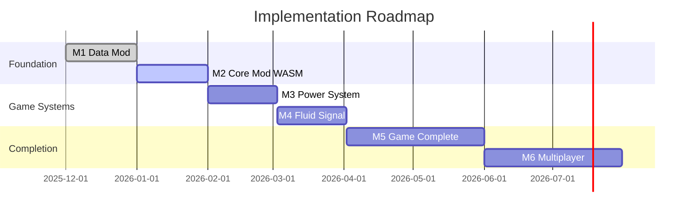

# Idle Factory - プロジェクト概要

> **対象読者**: ジュニアエンジニア以上で、このプロジェクトを初めて知る方

## 1. プロジェクトの概要

### ゲームについて

Idle Factoryは**Rust + Bevy**で開発中のボクセル型ファクトリービルダーゲームです。
Minecraft風の3Dボクセル世界で、Factorioのような工場自動化を楽しめます。

```
プレイヤーが操作 → 採掘機を設置 → コンベアで運搬 → 精錬炉で加工 → 製品を納品
                                ↓
                         完全自動化で放置プレイ可能
```

### 現在の状態

| 項目 | 値 |
|------|-----|
| バージョン | **0.3.136** |
| コード行数 | **約28,500行** |
| テスト数 | **593件** |
| エンジン | Bevy 0.15 |
| 対応プラットフォーム | Windows, Linux, WASM (Web) |

### このプロジェクトの特徴

1. **AIとの協働開発** - Claude Codeを使った「バイブコーディング」実験
2. **データ駆動設計** - アイテム・機械・レシピをTOMLで定義（コード変更不要）
3. **Mod対応設計** - 将来的にFactorioレベルのMod拡張を目指す

---

## 2. 技術スタック


| カテゴリ | 技術 | 用途 |
|----------|------|------|
| 言語 | Rust | ゲーム本体 |
| ゲームエンジン | Bevy 0.15 | ECS、レンダリング、入力処理 |
| データ形式 | TOML | アイテム・機械・レシピ定義 |
| 3Dモデル | MagicaVoxel (.vox), glTF | ボクセルモデル |
| 外部API | WebSocket (tokio-tungstenite) | Script Mod連携 |
| シリアライズ | serde + serde_json | セーブデータ |

---

## 3. アーキテクチャ概要

### ECS (Entity Component System)

BevyのECSパターンを採用しています。


- **Entity**: ゲーム内オブジェクト（機械、プレイヤー、ブロック等）
- **Component**: Entityに付与するデータ（位置、インベントリ等）
- **System**: Componentを処理するロジック（毎フレーム実行）

### ディレクトリ構成

```
src/
├── main.rs              # エントリーポイント
├── lib.rs               # ライブラリエクスポート
│
├── core/                # 動的IDシステム（ItemId, MachineId等）
│   ├── id.rs           # Phantom Type付きID
│   └── registry.rs     # 全レジストリ統合
│
├── components/          # ECSコンポーネント
│   ├── machines.rs     # Machine, MachineSlot, Conveyor
│   ├── input.rs        # 入力状態
│   └── network.rs      # マルチプレイ用NetworkId
│
├── game_spec/           # ゲーム仕様定義（Single Source of Truth）
│   ├── machines.rs     # MachineSpec, IoPort
│   ├── recipes.rs      # RecipeSpec
│   └── items.rs        # ItemSpec
│
├── systems/             # ECSシステム（ゲームロジック）
│   ├── chunk.rs        # チャンク生成・破棄
│   ├── player.rs       # プレイヤー操作
│   └── command/        # ゲーム内コマンド
│
├── machines/            # 機械処理ロジック
│   └── generic.rs      # generic_machine_tick()
│
├── logistics/           # 物流ロジック
│   └── conveyor.rs     # コンベア転送
│
├── world/               # ワールド管理
│   ├── mod.rs          # WorldData, ChunkData
│   └── terrain.rs      # 地形生成
│
├── events/              # イベントシステム
│   ├── mod.rs          # イベント定義
│   └── guarded_writer.rs # 循環防止付きWriter
│
├── modding/             # Mod対応
│   ├── loader.rs       # TOML読み込み
│   └── server.rs       # WebSocket API
│
├── save/                # セーブ・ロード
├── ui/                  # UI関連
├── setup/               # 初期化処理
└── plugins/             # Bevyプラグイン
```

---

## 4. 主要な設計パターン

### 4.1 動的IDシステム

従来のenumではなく、実行時に追加可能な動的IDを採用しています。

```rust
// Phantom Typeで型安全を保証
pub type ItemId = Id<ItemCategory>;
pub type MachineId = Id<MachineCategory>;
pub type RecipeId = Id<RecipeCategory>;

// 使用例
let iron_ore: ItemId = items::by_name("base:iron_ore").unwrap();
let furnace: MachineId = machines::by_name("base:furnace").unwrap();
```

**メリット**:
- Modから新アイテム追加可能
- コンパイル時の型チェック（ItemIdとMachineIdの混同を防止）

### 4.2 データ駆動設計

アイテム・機械・レシピはTOMLファイルで定義します。

```toml
# mods/base/items.toml
[[items]]
id = "base:iron_ore"
name = "鉄鉱石"
category = "ore"
stack_size = 64

# mods/base/machines.toml
[[machines]]
id = "base:furnace"
name = "精錬炉"
width = 1
height = 1
process_time = 2.0
slots = [
    { side = "top", type = "input", slot_id = 0 },
    { side = "bottom", type = "output", slot_id = 1 },
]
```

**メリット**:
- コード変更なしで新コンテンツ追加
- 非プログラマでも調整可能

### 4.3 イベントシステム

状態変更は全てイベント経由で行います。


```rust
// イベント送信
fn place_block(
    mut events: EventWriter<BlockPlaceEvent>,
) {
    events.send(BlockPlaceEvent {
        position: pos,
        item_id: block_id,
    });
}

// イベント受信
fn on_block_placed(
    mut events: EventReader<BlockPlaceEvent>,
) {
    for event in events.read() {
        // 処理
    }
}
```

**メリット**:
- マルチプレイ同期が容易
- Modがイベントをフックできる
- デバッグ・ログが容易

### 4.4 固定Tick

物理・ロジック処理は20 tick/秒（50ms/tick）の固定更新です。

```rust
// FixedUpdate: 固定間隔で実行（物理、機械処理）
app.add_systems(FixedUpdate, (
    generic_machine_tick,
    conveyor_transfer,
));

// Update: 毎フレーム実行（描画、入力）
app.add_systems(Update, (
    player_movement,
    render_ui,
));
```

**メリット**:
- マルチプレイ同期の決定論性
- 大規模工場でもフレームレート独立

---

## 5. モジュール詳細

### 5.1 core/ - 動的IDシステム


### 5.2 components/ - ECSコンポーネント

| コンポーネント | 説明 | 付与先 |
|---------------|------|--------|
| `Machine` | 機械の種類と状態 | 機械Entity |
| `MachineSlot` | インベントリスロット | 機械Entity |
| `Conveyor` | コンベアの向きと速度 | コンベアEntity |
| `Inventory` | プレイヤーの所持品 | プレイヤーEntity |
| `NetworkId` | マルチプレイ用ID | 同期対象Entity |

### 5.3 game_spec/ - 仕様定義


### 5.4 events/ - イベントシステム

| イベント | トリガー | 用途 |
|----------|----------|------|
| `BlockPlaceEvent` | ブロック設置時 | 世界更新、Mod通知 |
| `BlockBreakEvent` | ブロック破壊時 | 世界更新、Mod通知 |
| `MachineCompleteEvent` | 機械処理完了時 | 統計、Mod通知 |
| `ItemTransferEvent` | アイテム移動時 | ログ、Mod通知 |
| `QuestProgressEvent` | クエスト進行時 | UI更新 |

### 5.5 modding/ - Mod対応


| レイヤー | 実行方式 | 言語 | 用途 |
|---------|---------|------|------|
| Data Mod | TOML読み込み | - | アイテム/機械/レシピ追加 |
| Script Mod | WebSocket | Python, Lua, JS | イベントフック |
| Core Mod | WASM | Rust, C++ | ロジック追加（将来） |

---

## 6. 今後の実装予定

### ロードマップ



### M2: Core Mod基盤（現在進行中）

WASMを使って新しいゲームロジックをModで追加できるようにします。

```rust
// 将来のMod API例
#[no_mangle]
pub extern "C" fn on_machine_tick(entity: u64) {
    let power = host::get_power_level(entity);
    if power < 10 {
        host::set_machine_enabled(entity, false);
    }
}
```

### M3: 電力システム

発電機 → 電線 → 機械の電力供給を実装します。

### M4: 液体・信号

- パイプで液体を流す
- ワイヤーで信号を伝える（レッドストーン的な論理回路）

### M5: ゲーム完成

- 機械50種類以上
- レシピ100種類以上
- マップ・ブループリント・統計機能

### M6: マルチプレイ

P2P接続で複数プレイヤーが協力プレイできるようにします。

---

## 7. 開発環境のセットアップ

### 必要なツール

```bash
# Rust (stable)
curl --proto '=https' --tlsv1.2 -sSf https://sh.rustup.rs | sh

# Linux: 依存ライブラリ
sudo apt-get install libasound2-dev libudev-dev libx11-dev \
    libxcursor-dev libxrandr-dev libxi-dev libxkbcommon-dev
```

### ビルド & 実行

```bash
# クローン
git clone https://github.com/your-repo/idle_factory.git
cd idle_factory

# ビルド（初回は時間がかかります）
cargo build

# 実行
cargo run

# テスト
cargo test
```

### 開発用コマンド

```bash
# ビルドチェック（コンパイルエラー確認のみ、速い）
cargo check

# Clippy（Lintチェック）
cargo clippy

# フォーマット
cargo fmt

# WASMビルド（Web版）
./scripts/build-wasm.sh
```

---

## 8. 参照ドキュメント

| ファイル | 内容 |
|----------|------|
| `.claude/architecture.md` | 詳細なアーキテクチャ設計 |
| `.claude/implementation-plan.md` | タスク一覧と進捗 |
| `.claude/bugs.md` | 既知のバグと対策 |
| `.specify/roadmap.md` | マイルストーン詳細 |
| `CLAUDE.md` | Claude Code用の開発ガイド |

---

## 9. コントリビューションガイド

### コーディング規約

- `cargo fmt` でフォーマット
- `cargo clippy` の警告ゼロを維持
- 新機能にはテストを追加

### コミットメッセージ

```
feat: 新機能追加
fix: バグ修正
refactor: リファクタリング
docs: ドキュメント更新
test: テスト追加
```

### バグ修正の流れ

1. 再現テストを書く（失敗を確認）
2. 修正する
3. テストが通ることを確認
4. 関連テストも全部パスすることを確認

---

*最終更新: 2026-01-08*
